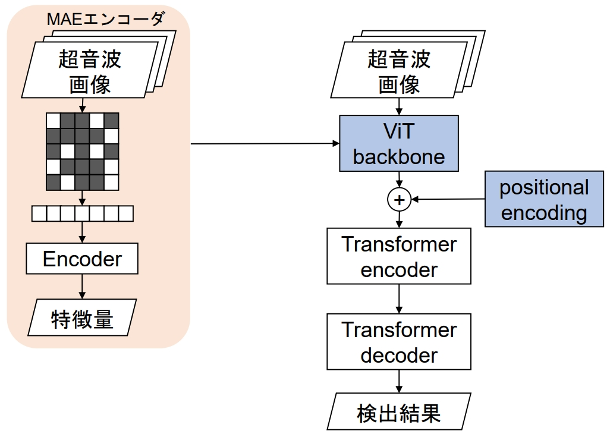

# AMED
## 目次
- [概要](#概要)
- [公式実装からの変更点](#公式実装からの変更点)
- [使用環境](#使用環境)
- [トレーニング](#トレーニング)
- [コマンドライン引数](#コマンドライン引数の意味)
- [MAE](#mae)
- [評価](#評価)
- [自己教師あり学習](#自己教師あり学習)

## 概要
[MAE](https://github.com/facebookresearch/mae)を使って物体検出精度の向上を図る．[MAE](https://github.com/facebookresearch/mae)は画像分類において高精度を記録しており，この特徴抽出手法は物体検出にも応用できる．物体検出は[DETR](https://github.com/facebookresearch/detr)を使用する．[DETR](https://github.com/facebookresearch/detr)はbackbone以降の処理にtransformerベースの処理を採用しており，ViTベースの[MAE](https://github.com/facebookresearch/mae)と相性が良いのではないかと考えた．

本研究の詳細は省略するので，関係者以外には不可解な点あり．

このコードでの精度評価に関しては[国立研究開発法人日本医療研究開発法人(AMED)](https://www.amed.go.jp)から提供されたデータセットを使用する．

## 公式実装からの変更点
[DETR](https://github.com/facebookresearch/detr)のbackboneはCNNベースで実装されているが，[MAE](https://github.com/facebookresearch/mae)はViTベースで作られている．よって[DETR](https://github.com/facebookresearch/detr)のbackboneをViTベースに変更した．[DETR](https://github.com/facebookresearch/detr)のコードをほぼ引用しているが，[backbone.py](https://github.com/batumaru12/AMED/blob/main/models/backbone.py)にViTベースのbackbone，MAEによる事前楽手に適応させたbackboneを実装した．

また，検出結果を確認した結果一つの物体に対する検出枠が複数得られることが多かった．よってMNSの実装を行った．MNSは[detr.py](https://github.com/batumaru12/AMED/blob/main/models/detr.py)に実装されている．285行目あたりに書かれた`use_nms`がNMSの使用フラグとなっており，TrueにすることでNMSを使用する．



## 使用環境
基本的には[requirements.txt](https://github.com/batumaru12/AMED/blob/main/requirements.txt)でどうにかなるはず．
```
pip install -r requirements.txt
```

ならなかったら下のコマンドを参照しながら入れて．詳しくは知らないが[requirements.txt](https://github.com/batumaru12/AMED/blob/main/requirements.txt)で入れるとpytorch系でエラーが出るとか出ないとか…

- python 3.12.10
- pytorch 2.5.1 [ダウンロードコマンド](https://pytorch.org/get-started/previous-versions/)
```
pip install torch==2.5.1 torchvision==0.20.1 torchaudio==2.5.1 --index-url https://download.pytorch.org/whl/cu118
```
- cython 3.0.11
```
pip install cython==3.0.11
```
- scipy 1.13.1
```
pip install scipy==1.13.1
```
pycocotools 2.0.8
```
pip install pycocotools==2.0.8
```
- timm 1.0.11
```
pip install timm==1.0.11
```
- matplotlib 3.9.2
```
pip install matplotlib
```
- transformers 4.45.2
```
pip install transformers==4.45.2
```

venvにて仮想環境を構築．

## トレーニング
学習を行うには[train.py](https://github.com/batumaru12/AMED/blob/main/train.py)を使用する．大本は[DETRの公式実装](https://github.com/facebookresearch/detr)の[main.py](https://github.com/facebookresearch/detr/blob/main/main.py)を参考に作成した．変更点はそれぞれのエポックごとに学習結果を出力するように変更した．モデルをエポックごとに保存する分，PCの容量を多く消費するので注意すること(PC容量が少ない場合[main.py](https://github.com/facebookresearch/detr/blob/main/main.py)の実行を推奨)．また，提案手法を実現するために必要なコマンドライン引数の追加を行った．

エポック 500 バッチサイズ 16 でトレーニング:
```
python train.py --batch_size 16 --epochs 500 --lr_drop 350 --num_classes 2 --num_queries 10
```
`--num_classes`はデータセットのクラス数+1にすること．分類するクラス数+背景クラスのため．

MAEを用いて学習する場合:
```
python train.py --batch_size 16 --epochs 500 --lr_drop 350 --num_classes 2 --backbone usemae --num_queries 10 --mae_weights_path MAEの事前学習結果(.pthファイル)
```

複数GPUを使って学習を行う場合:
```
CUDA_VISIBLE_DEVICES=0,1,2 python -m torch.distributed.launch --nproc_per_node=3 --use_env
```
これを`train.py`の前につける．また，エラーが出るため`--find_unused_parameters`をつけること．GPU間で対応をとるときにパラメータに不足がないか確認がある．その時に，セグメンテーションタスクなどで用いるパラメータが物体検出の場合ないため，パラメータ不足のエラーを吐く．`--find_unused_parameters`を使うことでパラメータ不足の確認をスキップ．

### コマンドライン引数の意味
- `--lr` 学習率の設定(デフォルト: 1e-4)
- `--batch_size` バッチサイズの設定　使用環境に合わせて変更(デフォルト: 2)
- `--epochs` エポック数の設定　公式の実験では最終的に500エポック(デフォルト: 300)
- `--lr_drop` 学習率を減衰させるエポック数　デフォルトと同じ割合に設定すればよい(デフォルト: 200)
- `--num_classes` 部隊検出のクラス数　データセットのクラス数+1(背景クラス)に設定(デフォルト: None)
- `--backbone` バックボーンの種類を設定　vitでViTバックボーン，maevitでMAEバックボーン(デフォルト: resnet50)
- `--num_queries` クエリ数を設定　最大検出枠+10ぐらいに設定(デフォルト: 100)
- `--eos_coef` 背景クラスの損失重み(デフォルト: 0.1)
- `--coco_path` cocoデータセットが入ったフォルダを指定(デフォルト: ./coco)
- `--output_dir` 結果とログの出力フォルダを設定
- `--device` CPUを使うかGPUを使うか(デフォルト: cuda)
- `--resume` DETRの事前学習済みモデルを設定
- `--start_epoch` 途中から学習を再開する場合，そのエポックを設定(デフォルト: 0)
- `--eval` これを使うと推論モードになり精度を出力する
- `--mae_weights_path` MAEの事前学習済み重みを設定
- `--mae_mask_ratio` MAEのマスク率を設定(デフォルト: 0.75)
- `--find_unused_parameters` 複数のGPUを使う際に指定

学習の進行状況を`--output_dir`に設定したパスに`log.txt`として保存される．[plot.py](https://github.com/batumaru12/AMED/blob/main/plot.py)を使用することで，グラフにすることが可能．学習状況の確認に適宜利用すること．

## MAE
バックボーンにMAEを用いる場合，[Masked Autoencoderの公式実装](https://github.com/facebookresearch/detr/blob/main/main.py)による事前学習が必要．DETRはcoco形式のデータセットを使うが，MAEはcoco形式のデータセットに対応していない．coco形式のデータセットに対応させたMAEは[main_pretrain.py](https://github.com/batumaru12/AMED/blob/main/main_pretrain.py)．このリポジトリにあるファイルだけでは多分MAEの学習はできないので，[Masked Autoencoderの公式実装](https://github.com/facebookresearch/detr/blob/main/main.py)をcloneして事前に学習を済ませすこと．これを使て学習してできた.pthファイルを`--mae_weights_path`に指定すること．

```
git clone https://github.com/facebookresearch/mae
```

## 評価
評価は[train.py](https://github.com/batumaru12/AMED/blob/main/train.py)で`--eval`を指定することで推論モードにできる．pycocotoolsを用いたAPとARの算出が可能．`--dataset_file`で入力されたフォルダの画像を対象に評価を行う．

可視化された結果を得たい場合は[detection_result.py](https://github.com/batumaru12/AMED/blob/main/detection_result.py)を使う．`--image_dir`内すべての画像を対象に推論結果の可視化を行い，`--outout_dir`に出力．`--video`を使うと動画に対し推論も可．

## 精度評価
評価方法として先行研究(YOLOv3)と，ViTをそのまま事前学習したもの，ViTをMAEを用いて事前学習したもので比較した．評価する際のIoU閾値は0.1とする(先行研究のYOLOv3の評価に合わせた)．

|model|AP|AR|F1 score|dataset|
|----|:----:|:----:|:----:|:----:|
|YOLOv3|0.873|0.885|0.879|[AMED](https://www.amed.go.jp)|
|DETR(ViT)|0.919|0.977|0.944|[AMED](https://www.amed.go.jp)|
|DETR(MAE)|0.919|0.980|0.949|[AMED](https://www.amed.go.jp)|

先行研究のYOLOv3に比べ，いずれの手法でも高い結果が得られた．今後は，閾値を高くした場合に精度が落ちにくいモデルの実装が必要となる．

## 自己教師あり学習
本研究では，与えられたデータセットではアノテーションされていない腫瘍があることを前提に，一度目の検出で過剰に腫瘍を検出し，その結果から疑似ラベルを得て再び学習を行う．検出結果から疑似ラベルを得るために，[detection_result.py](https://github.com/batumaru12/AMED/blob/main/detection_result.py)で`--save_json`を指定する．`--save_json`を設定することで検出結果を画像で出力するのと同時に，coco形式のjsonファイルで検出結果を保存する．

自己教師あり学習を何回か繰り返す場合，[self_train.py](https://github.com/batumaru12/AMED/blob/main/self_train.py)の実行がおすすめ．学習，検出，検出結果による学習を繰り返す．